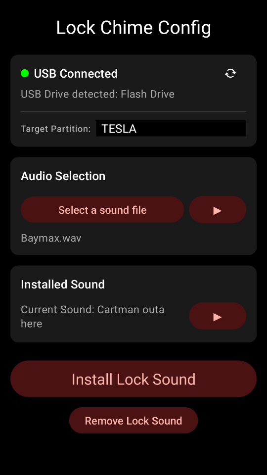
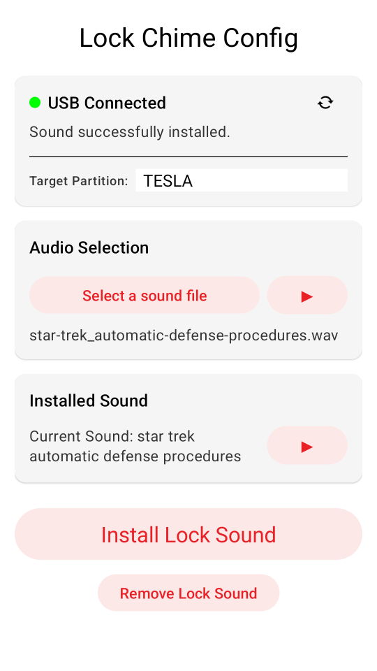

# LockJingle

This Android app allows the user to configure the Tesla Lock Chime using their phone. It supports
autodetection of USB drives, browsing/previewing/installing the chosen file to external storage.

It also supports multiple partitions on the target drive. Installing a LockChime.wav file to each
of the partitions gives a pseudo-random lock sound.

## WARNINGS
⚠ this app requests ACCESS_ALL_FILES permissions to allow it to automatically detect external storage,
and to provide a seamless user experience.

⚠ the autodetection takes around 5 seconds after the USB is inserted. To avoid the delay insert the
USB before launching the app

### Video

Click the screenshot for a video of the app running

### Features

* Auto-detects the presence of external USB (or manually scan for attached USB drive)
* Files can be read from internal, external (USB), or Google Drive
* Supports reading wav, ogg, and mp3 file
* Allows the uer to preview the selected audio
* Writes the file to the USB in the required location with the required name
* Updates the metadata in the written file to allow the installed file to be identified
* Allows the user to play the currently installed file
* Supports multiple partitions on the USB (which enables pseudo-random lock sounds)
* Supports light and dark modes (will follow the current mode)

### Usage

1. Connect a USB drive to your phone. Depending on your drive you may need an adaptor to be able to
connect it to your phone
1. Launch the app
1. Browse for an audio file (wav, mp3 or ogg)
1. Preview the selected sound if desired
1. Preview the currently installed sound if desired
1. Click "Install Lock Sound". If you get an error about no USB found, ensure it is inserted
correctly and click "Re-scan for USB drive" and then try installing again. you should see the
message "Sound successfully installed"
1. Plug the USB drive into the USB port in your Tesla's glove box
1. Launch Boombox on your Tesla and select "USB" for the lock sound

### Privacy

This app doesn't collect data of any sort, however Google Play requires a privacy policy. This is
available here: [Privacy Policy](PRIVACY.md)

### Problems?

Shoot me an email if you have any issues. I have limited devices to test on, so I'm sure there will
be some quirks out there.  

### About Me

I'm a retired software engineer who still writes code for fun… mostly because the alternative is
talking to people.

I spent years turning caffeine into features, debugging at 2 a.m., and pretending “it works on my
machine” was a valid strategy. Now I mostly make things that amuse me (and hopefully you).

If my work has ever saved you from a stack overflow rabbit hole, made you snort-laugh, or simply
delayed your own existential crisis by a few minutes — feel free to [buy me a coffee](https://buymeacoffee.com/thecodemonkeyau).

I’ll use it to stay slightly more functional and slightly less grumpy.

Thanks for being here. You’re the real MVP. ☕

